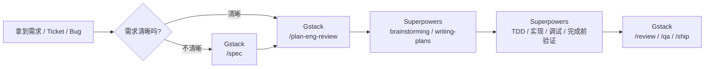
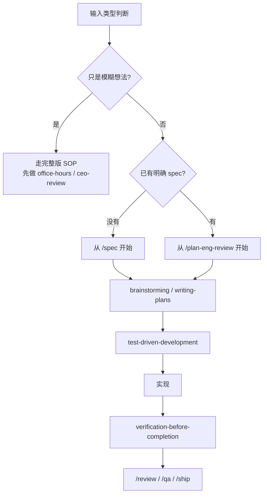

# 开发视角精简 SOP

这份文档是上一份完整 SOP 的**开发版精简路径**。

它解决的不是“怎么从 0 定义一个产品”，而是：

- 我作为开发，拿到一个需求后该从哪一步开始
- 哪些步骤必须保留
- 哪些步骤可以按场景省略
- 在日常研发里，怎么把 Gstack 和 Superpowers 用得足够稳，但不过度繁琐

一句话总结：

**开发视角下，Gstack 负责钉住需求和方案，Superpowers 负责钉住实现纪律，最后再回 Gstack 做交付。**

---

## 0. 开发日常总览图





---

## 1. 开发最常用的主路径

如果你已经是一个接需求开发的人，最常用的主路径通常不是从 `/office-hours` 开始，而是：

```text
/spec
/plan-eng-review
brainstorming
writing-plans
test-driven-development
实现
systematic-debugging
verification-before-completion
/review
/qa
/ship
```

这是最推荐你记住的一条“开发日常主线”。

它对应的是：

1. 先把需求钉清楚
2. 再把工程方案钉清楚
3. 再拆成可执行任务
4. 先想验证，再写实现
5. 遇到 bug 先查根因
6. 完成前做真实验证
7. 最后做 review、QA 和发 PR

---

## 2. 开发该从哪一步开始

### 场景 A：你拿到的是一个模糊想法

例如：

- “做一个新的通知中心”
- “做一个智能导出功能”
- “把这个产品变得更好用”

这种情况不要直接进入开发版流程，应该先回到完整版 SOP，从：

```text
/office-hours
/plan-ceo-review
/spec
```

开始。

### 场景 B：你拿到的是明确需求，但没有正式 spec

例如：

- 产品经理给了需求描述
- issue 里写了目标，但边界不够清楚
- 有会议结论，但没有结构化文档

这种情况从：

```text
/spec
```

开始。

### 场景 C：你拿到的是明确 spec

例如：

- 已有需求文档
- 已有验收标准
- 范围和非目标已经清楚

这种情况可以直接从：

```text
/plan-eng-review
```

开始。

---

## 3. 每一步怎么用

### Step 1: `/spec`

**什么时候用**

- 需求不够结构化
- 范围、非目标、验收标准还不清楚

**作用**

把需求整理成开发能执行的 spec。

**输入示例**

```text
/spec

请把当前需求整理成开发可执行 spec，至少包括：
1. 背景和目标
2. 功能范围
3. 非目标
4. 核心流程
5. 验收标准
6. 风险和开放问题

要求：
- 不扩范围
- 明确哪些是本期必须做
- 明确哪些不是这次要做的
```

**通过标准**

- 你已经知道“这次做什么”
- 你也知道“这次不做什么”

### Step 2: `/plan-eng-review`

**什么时候用**

- 已有 spec，需要锁工程方案

**作用**

把需求变成可落地工程方案。

**输入示例**

```text
/plan-eng-review

请基于当前 spec 做工程评审，输出：
1. 核心模块
2. 需要改哪些层
3. 数据流
4. 错误处理
5. 边界情况
6. 测试策略
7. 推荐实施顺序
```

**通过标准**

- 你知道要改哪些模块
- 你知道先从哪一步做
- 你知道测试怎么覆盖

### Step 3: `brainstorming`

**什么时候用**

- 准备开始具体实现某个任务时

**作用**

不是重新做产品设计，而是把当前实现任务收窄成一个单点执行目标。

**输入示例**

```text
Use Superpowers brainstorming for implementation design.

Only focus on Task T1.
Need:
1. which files/modules should change
2. what edge cases matter
3. what is out of scope
4. what tests are needed
```

**通过标准**

- 当前任务边界足够窄
- 你不会一口气把整个需求全写了

### Step 4: `writing-plans`

**作用**

把单任务拆成执行步骤。

**输入示例**

```text
Use Superpowers writing-plans.

Create a concrete plan for Task T1:
1. ordered implementation steps
2. files/modules touched
3. tests to add or modify
4. verification checkpoints
```

**通过标准**

- 已经细到可以按步骤改代码
- 不需要边写边重新想大方向

### Step 5: `test-driven-development`

**作用**

先立验证方式，再写实现。哪怕不做严格红绿重构，也要先把验证逻辑讲清楚。

**输入示例**

```text
Use Superpowers test-driven-development.

For Task T1:
1. identify the smallest missing verification
2. propose tests to add first
3. then implement the minimum code to satisfy them
```

**通过标准**

- 写代码前已经知道怎么证明它对了
- 测试不是最后补的

### Step 6: 实现

**作用**

只实现当前任务，不发散。

**建议提示词**

```text
Implement only Task T1.

Requirements:
1. only touch relevant files
2. keep changes minimal
3. do not expand scope
4. explain validation after implementation
5. if spec ambiguity exists, call it out first
```

### Step 7: `systematic-debugging`

**什么时候用**

- 测试挂了
- 行为不符合 spec
- 改一处坏一处
- 不确定根因

**作用**

先查根因，再改代码。

**输入示例**

```text
Use Superpowers systematic-debugging.

Problem:
- exact failing behavior
- failing test or observed symptom

Need:
1. root cause hypothesis
2. evidence path
3. minimal fix proposal
4. verification after fix
```

**通过标准**

- 不是靠猜修 bug
- 能说明“为什么这么改”

### Step 8: `verification-before-completion`

**作用**

防止“我觉得差不多就是做完了”。

**输入示例**

```text
Use Superpowers verification-before-completion.

For Task T1, verify:
1. tests executed
2. behavior matches spec
3. adjacent flow has no obvious regression
4. what is verified vs not verified
```

**通过标准**

- 已跑测试
- 已做行为验证
- 已明确未验证项

### Step 9: `/review`

**作用**

做工程质量 review。

**输入示例**

```text
/review

请 review 当前分支改动，重点检查：
1. 逻辑漏洞
2. 边界遗漏
3. 测试缺口
4. 多余复杂度
5. 与 spec 不一致的地方
```

### Step 10: `/qa`

**作用**

做真实功能验收。

**输入示例**

```text
/qa https://staging.example.com
```

如果只想出报告：

```text
/qa-only https://staging.example.com
```

### Step 11: `/ship`

**作用**

做交付收口，发 PR。

**输入示例**

```text
/ship
```

---

## 4. 开发最该保留的步骤

如果你想精简流程，下面这些步骤最不建议省：

- `/spec`
- `/plan-eng-review`
- `brainstorming`
- `test-driven-development`
- `verification-before-completion`
- `/review`

原因很简单：

- `/spec` 防止需求理解偏差
- `/plan-eng-review` 防止方案拍脑袋
- `brainstorming` 防止任务边界失控
- `test-driven-development` 防止先写后补验证
- `verification-before-completion` 防止未验证即完成
- `/review` 防止明显问题带进 PR

---

## 5. 哪些步骤可以按场景省

### 一般可以省的

- `/office-hours`
- `/plan-ceo-review`
- `/plan-design-review`
- `/plan-devex-review`
- `/retro`

这些更多取决于你是否还承担产品、设计或 owner 职责。

### 什么时候再补回来

- 需求本身很模糊：补 `/office-hours` 和 `/plan-ceo-review`
- UI/交互复杂：补 `/plan-design-review`
- 做开发者产品：补 `/plan-devex-review`
- 需求很大或刚交付完大版本：补 `/retro`

---

## 6. 开发版最小闭环

如果你只想记一条最短可用流程，记这个：

```text
/spec
/plan-eng-review
brainstorming
writing-plans
test-driven-development
实现
systematic-debugging
verification-before-completion
/review
/qa
/ship
```

这就是最推荐的**开发日常最小闭环**。

---

## 7. 实际使用建议

- 不要一拿到需求就写代码，先过 `/spec` 或 `/plan-eng-review`
- 不要一次实现整个大需求，先拆成 T1 / T2 / T3
- 不要把 `brainstorming` 用成产品讨论，它在开发阶段是任务收窄工具
- 不要把 `systematic-debugging` 当成“最后没办法了再用”，一旦出现异常就切进去
- 不要跳过 `verification-before-completion`

一句话给开发的最终建议：

**先用 Gstack 钉清需求和方案，再用 Superpowers 钉清实现和验证，最后回 Gstack 钉清交付。**
