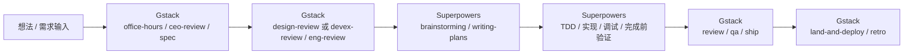
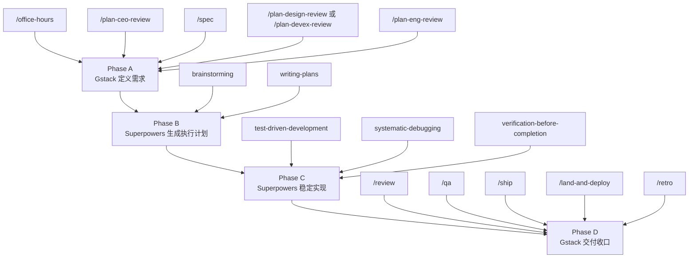

# Gstack + Superpowers 完整需求开发 SOP

这份文档不是“纯 Gstack 用法”，而是基于前面讨论的**混合工作流**整理出来的 SOP：

- **Gstack**：负责把方向、范围、Spec、体验和工程方案想清楚
- **Superpowers**：负责把实现过程做扎实，避免跳步、盲改、未验证即完成

一句话总结：

**Gstack 管“做什么”和“为什么这样做”，Superpowers 管“怎么稳地做完”。**

---

## 0. 流程总览图





---

## 1. 先搞清楚两者分别负责什么

### Gstack 负责的阶段

Gstack 更适合这些事情：

- 需求收敛
- 产品范围判断
- Spec 编写
- 设计评审
- 开发者体验评审
- 工程方案评审
- 代码评审
- QA 验收
- 发 PR / 上线 / 复盘

它的典型入口是 **slash commands**，例如：

```text
/office-hours
/plan-ceo-review
/spec
/plan-design-review
/plan-devex-review
/plan-eng-review
/review
/qa
/ship
/land-and-deploy
/retro
```

### Superpowers 负责的阶段

Superpowers 更适合这些事情：

- 把模糊执行任务拆成可落地计划
- 在动手前做技术方案收敛
- 按 TDD 或至少验证优先的方式实现
- 发现 bug 时先查根因，而不是直接乱改
- 在宣布完成前，先做真实验证

它更像一套**执行纪律和技能工作流**，而不是一组与 Gstack 完全对称的 slash 命令。

在我们前面讨论的文章语境里，它最关键的几个能力是：

- `brainstorming`
- `writing-plans`
- `test-driven-development`
- `systematic-debugging`
- `verification-before-completion`

你可以把它理解成：

- Gstack 在“写代码之前”更强
- Superpowers 在“开始实现之后”更强

---

## 2. 标准混合流程

完整需求建议按下面顺序推进：

```text
Gstack:
/office-hours
/plan-ceo-review
/spec
/plan-design-review 或 /plan-devex-review
/plan-eng-review

Superpowers:
brainstorming
writing-plans
test-driven-development
实现
systematic-debugging
verification-before-completion

Gstack:
/review
/qa https://你的staging地址
/ship
/land-and-deploy
/retro
```

对应到真实过程就是：

1. 用 Gstack 把需求、范围、Spec 和方案定下来
2. 切到 Superpowers，把 Spec 翻译成执行计划和实现步骤
3. 用 Superpowers 的纪律把代码做稳
4. 再切回 Gstack 做 review、QA、交付和复盘

### 阶段切换原则

- 在 `/plan-eng-review` 之前，不要急着进入编码
- 进入 `brainstorming` 和 `writing-plans` 后，目标是把单个实现任务收窄，而不是回到产品发散
- 进入 `test-driven-development` 后，优先验证和实现，不再扩需求
- 完成实现后，必须切回 Gstack 做 `/review` 和 `/qa`

---

## 3. 安装与前提

### Gstack 安装

```bash
git clone --single-branch --depth 1 https://github.com/garrytan/gstack.git ~/.claude/skills/gstack
cd ~/.claude/skills/gstack
./setup
```

### Superpowers 前提

Superpowers 不是用来替代 Gstack 的，而是用来补“执行阶段”的。

如果你的宿主已经带有 Superpowers skills，那么重点使用这些能力：

- `brainstorming`
- `writing-plans`
- `test-driven-development`
- `systematic-debugging`
- `verification-before-completion`

注意：

- **Gstack 这一边更像 slash commands**
- **Superpowers 这一边更像 skills / workflow**

所以这份 SOP 里会把两边分开写，不强行伪装成同一种调用方式。

---

## 4. Phase A：用 Gstack 把需求定义清楚

### Step A1: `/office-hours`

**作用**

把“我要做什么”问清楚。重点不是技术实现，而是用户、痛点、场景、MVP 和非目标。

**输入示例**

```text
/office-hours

我要做一个 AI 日报产品，帮团队每天自动汇总项目进展、风险和待办。
目标用户是 10-50 人的软件团队。
我现在不确定 MVP 应该做到多窄。
```

**产出**

- 目标用户
- 核心痛点
- MVP 范围
- 非目标
- 成功标准
- 2-3 个实现方向

**通过标准**

- 你能一句话说清产品是什么
- 你知道本期明确不做什么
- 你知道最小切口在哪里

### Step A2: `/plan-ceo-review`

**作用**

从 CEO / 产品负责人视角挑战你的需求边界，判断现在应该扩、缩还是保持范围。

**输入示例**

```text
/plan-ceo-review

请基于刚才的 office-hours 结果，帮我判断：
1. 这个方向是不是太大
2. 最值得先做的 20% 是什么
3. 哪些功能现在不该做
4. 这个需求真正的 10 分版本是什么
```

**产出**

- 范围扩张建议或收缩建议
- 真正高价值功能
- 明确的砍需求建议
- 推荐范围策略

**通过标准**

- 你已经锁定本期范围
- 不再纠结“顺便加一个功能”

### Step A3: `/spec`

**作用**

把模糊需求整理成可执行 spec。这一步就是文章里说的中间层之一：从“产品语言”切到“执行文档”。

**输入示例**

```text
/spec

请把已经确认的需求整理成可执行 spec，至少包括：
1. 背景和目标
2. 用户和场景
3. 功能范围
4. 非目标
5. 核心流程
6. 验收标准
7. 风险和开放问题

要求：
- 用最小可行方案
- 不要过度设计
- 输出适合直接进入方案评审
```

**产出**

- 正式 spec
- 功能边界
- 验收条件
- 风险和开放问题

**通过标准**

- 工程师不需要再猜需求
- 后续设计评审和工程评审都能基于这份 spec 展开

### Step A4: `/plan-design-review` 或 `/plan-devex-review`

#### 如果是用户产品，跑 `/plan-design-review`

**作用**

审查 UI、交互和体验层方案。

**输入示例**

```text
/plan-design-review

请基于当前 spec，从用户体验和界面质量角度审查：
1. 核心路径是否顺畅
2. 信息层级是否清晰
3. 有没有 AI slop 风险
4. 哪些交互应该简化
5. 哪些设计决策还没定
```

#### 如果是开发者产品，跑 `/plan-devex-review`

**作用**

审查 API、CLI、SDK、文档和上手路径。

**输入示例**

```text
/plan-devex-review

请基于当前 spec，从开发者体验角度审查：
1. 首次上手路径是否足够短
2. 文档 / 示例 / API 设计是否容易理解
3. 哪些地方会让开发者卡住
4. magical moment 是什么
5. 这个版本最该优化的 DX 环节是什么
```

**通过标准**

- 用户产品：关键路径和交互质量已经想清楚
- 开发者产品：首次上手体验和 friction point 已经识别清楚

### Step A5: `/plan-eng-review`

**作用**

锁技术方案。这里要把 spec 变成可落地的架构、模块边界、数据流和测试策略。

**输入示例**

```text
/plan-eng-review

请基于当前 spec 做工程评审，输出：
1. 架构划分
2. 核心模块
3. 数据流
4. 状态流转
5. 错误处理
6. 边界情况
7. 测试策略
8. 推荐的实施顺序

要求：
- 优先最小可行架构
- 明确哪些同步，哪些异步
- 明确失败路径
- 明确需要测试什么
```

**产出**

- 技术架构
- 模块边界
- 数据流和失败路径
- 测试矩阵
- 实施顺序

**通过标准**

- 你知道先实现哪一块
- 你知道要改哪些模块
- 你知道怎么验证结果

---

## 5. Phase B：切到 Superpowers 做执行规划

这一段是上一版文档漏掉的重点。

Gstack 的 `/spec` 和 `/plan-eng-review` 已经把“做什么”和“大致怎么做”讲清楚了，但**还没有把它翻译成一个稳定的编码执行过程**。这时应该切到 Superpowers。

### Step B1: `brainstorming`

**作用**

在真正写代码前，先把当前这个实现任务再收敛一次，但这次不是产品收敛，而是**技术实现收敛**。

它要回答的问题是：

- 这次只做哪个任务
- 需要改哪些模块
- 哪些边界情况必须覆盖
- 测试从哪里切入

**建议输入方式**

```text
Use Superpowers brainstorming for implementation design.

Context:
- We already have a product spec
- We already have an engineering review
- Now only focus on implementing Task T1: 用户首次创建日报规则

Please help narrow the implementation scope:
1. Which files/modules should change
2. Which edge cases matter for T1
3. What is explicitly out of scope
4. What tests should exist before or with the change
```

**产出**

- 单任务实现边界
- 文件/模块影响面
- 边界条件
- 测试入口

### Step B2: `writing-plans`

**作用**

把单任务收敛结果拆成具体执行计划，而不是直接开写。

**建议输入方式**

```text
Use Superpowers writing-plans.

Create a concrete implementation plan for Task T1 based on:
- product spec
- engineering review
- implementation brainstorming result

Need:
1. ordered steps
2. code changes by area
3. tests to add or update
4. verification checkpoints
5. rollback / failure considerations if relevant
```

**产出**

- 可执行步骤清单
- 每步影响范围
- 对应测试和验证点

**通过标准**

- 计划已经细到可以逐步实现
- 不需要实现过程中继续临时发散

---

## 6. Phase C：用 Superpowers 的纪律去实现

### Step C1: `test-driven-development`

**作用**

优先明确验证方式，再写实现。即使不做严格红绿重构，也要先确认：

- 测什么
- 怎么证明已经修好 / 做完
- 哪些测试要补

**建议输入方式**

```text
Use Superpowers test-driven-development.

For Task T1:
1. Identify the smallest meaningful failing or missing verification
2. Propose the tests to add first
3. Then implement the minimum code to make them pass
```

**产出**

- 初始验证点
- 新增/修改测试
- 对应最小实现

### Step C2: 开始实现

这时才真正动代码。

**建议实现提示词**

```text
Implement only Task T1 based on the approved plan.

Requirements:
1. only change files relevant to T1
2. do not expand scope
3. keep changes minimal
4. explain the validation path after implementation
5. if spec ambiguity is found, stop and call it out
```

### Step C3: `systematic-debugging`

**作用**

实现过程中只要遇到 bug、测试失败、行为不符，就不要直接乱改，先查根因。

**适合场景**

- 测试挂了
- 页面行为不符合 spec
- 回归了
- 改了一处，另一处坏了

**建议输入方式**

```text
Use Superpowers systematic-debugging.

Problem:
- describe the exact failing behavior
- include the failing test or observed symptom

Need:
1. likely root cause
2. evidence path
3. minimal fix proposal
4. verification after fix
```

### Step C4: `verification-before-completion`

**作用**

在你想说“做完了”之前，先做真实验证。

它重点卡住两件事：

- 不能只靠“我觉得差不多”
- 不能只靠代码 diff 判断完成

**建议输入方式**

```text
Use Superpowers verification-before-completion.

For Task T1, verify:
1. tests executed
2. behavior matches spec
3. no obvious regression in adjacent flow
4. list what is verified vs not verified
```

**通过标准**

- 已跑测试
- 已验证行为
- 已明确哪些没验证
- 不会“自欺欺人式完成”

---

## 7. Phase D：切回 Gstack 做交付收口

### Step D1: `/review`

**作用**

做代码 review，不是产品 review。重点看逻辑漏洞、遗漏、复杂度和测试缺口。

**输入示例**

```text
/review

请 review 当前分支改动，重点检查：
1. 逻辑漏洞
2. 边界情况遗漏
3. 测试缺口
4. 不必要复杂度
5. 与 spec 不一致的地方
```

### Step D2: `/qa` 或 `/qa-only`

#### 真实验收

```text
/qa https://staging.example.com
```

#### 只出报告

```text
/qa-only https://staging.example.com
```

**作用**

- 跑真实流程
- 找交互 bug
- 看核心路径是否闭环

### Step D3: `/ship`

```text
/ship
```

**作用**

- 收口测试
- 推送改动
- 创建 PR

### Step D4: `/land-and-deploy`

```text
/land-and-deploy
```

**作用**

- 合并
- 部署
- 验证线上健康

### Step D5: `/retro`

```text
/retro
```

**作用**

- 复盘范围控制
- 复盘实现质量
- 复盘测试 / QA / 交付过程

---

## 8. 最推荐的完整闭环

如果你要做一个真正完整的新需求，最推荐这样跑：

### Phase A：Gstack 定义需求

```text
/office-hours
/plan-ceo-review
/spec
/plan-design-review 或 /plan-devex-review
/plan-eng-review
```

### Phase B：Superpowers 生成执行计划

```text
brainstorming
writing-plans
```

### Phase C：Superpowers 执行实现

```text
test-driven-development
实现
systematic-debugging
verification-before-completion
```

### Phase D：Gstack 做交付和验收

```text
/review
/qa https://你的staging地址
/ship
/land-and-deploy
/retro
```

---

## 9. 两种简化版

### 小功能 / 小需求

如果需求很小，可以收缩成：

```text
Gstack:
/spec
/plan-eng-review

Superpowers:
brainstorming
test-driven-development
实现
verification-before-completion

Gstack:
/review
/qa
/ship
```

### 方向已经很清楚，只需要执行

如果你的产品方向和 spec 已经非常明确，可以跳过前面的产品探索，直接从：

```text
/spec
/plan-eng-review
brainstorming
writing-plans
test-driven-development
实现
verification-before-completion
/review
/qa
/ship
```

---

## 10. 一句话版分工

- `/office-hours`：Gstack 帮你搞清楚要做什么
- `/plan-ceo-review`：Gstack 帮你搞清楚值不值得这样做
- `/spec`：Gstack 把模糊需求变成正式 spec
- `/plan-design-review` / `/plan-devex-review`：Gstack 审体验层
- `/plan-eng-review`：Gstack 审技术层
- `brainstorming`：Superpowers 把实现任务收窄
- `writing-plans`：Superpowers 把任务拆成执行步骤
- `test-driven-development`：Superpowers 先立验证再写代码
- `systematic-debugging`：Superpowers 遇到 bug 先查根因
- `verification-before-completion`：Superpowers 防止未验证就宣布完成
- `/review`：Gstack 做工程 review
- `/qa`：Gstack 做真实验收
- `/ship`：Gstack 发 PR
- `/land-and-deploy`：Gstack 合并上线
- `/retro`：Gstack 复盘

---

## 11. 使用建议

- 不要把 Gstack 和 Superpowers 当成竞品。
- Gstack 不负责替你建立实现纪律，Superpowers 正好补这个空缺。
- Superpowers 也不负责替你决定产品方向，Gstack 正好补这个空缺。
- 真正稳的做法不是二选一，而是：

**Gstack 定义问题 -> Superpowers 执行问题 -> Gstack 验收结果**

- 不要跳过 `/spec`。
- 不要跳过 `verification-before-completion`。
- 不要在实现阶段继续发散需求。
- 一次只做一个实现任务，比一次吃完整个大需求稳得多。
